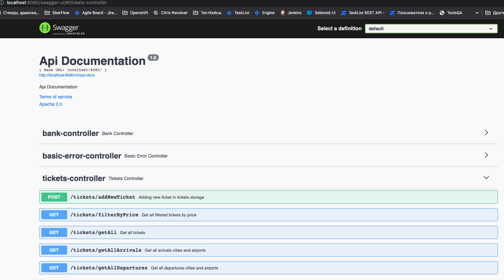
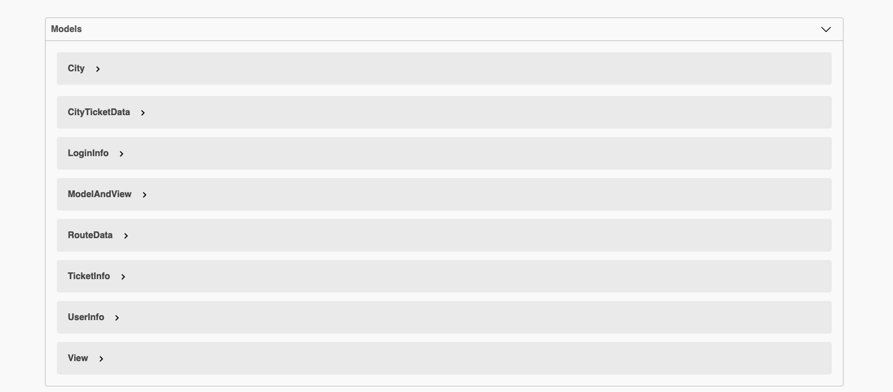
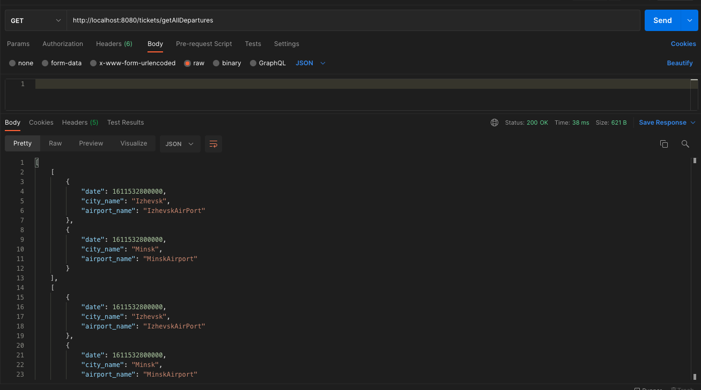
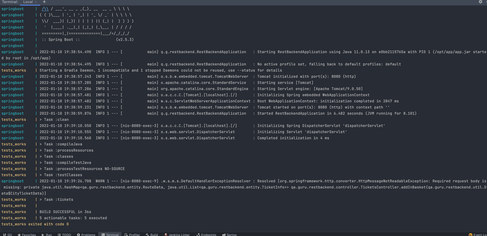

# API тесты для RESTful веб-сервиса. Данный серви написан в учебных целях и имитирует backend примитвного магазина по продаже авиавбилетов.


## Используемые технологии и инструменты

<a href="https://www.jetbrains.com/idea/">
    
</a>
<a href="https://www.jetbrains.com/idea/">
    
</a>
<a href="https://www.jetbrains.com/idea/">
    
</a>
<a href="https://www.jetbrains.com/idea/">
    
</a>
<a href="https://www.jetbrains.com/idea/">
    
</a>
<a href="https://www.jetbrains.com/idea/">
    
</a>
<a href="https://www.jetbrains.com/idea/">
    
</a>
<a href="https://www.jetbrains.com/idea/">
    
</a>


IntelliJ IDEA, Java, Gradle, JUnit5, Github, Jenkins, Rest-Assured, Dockers, Spring, Swagger

## Реализованы проверки endpoints:
### API
- [X] - tickets/getAll
- [X] - tickets/getAllDepartures
- [X] - tickets/getAllArrivals
- [X] - tickets/addNewTicket
- [X] - tickets/filterByPrice


    
C помощью Spring создается RESTful web-сервис
Так как подключение базы данных отсутствует, данные создаются синтетически
С помощью подключенной библиотеки REST-ASSURED сервис покрыт API тестами
Сущетсвует два способа запуска сервиса и тестов

1. 
 - Скачать проект с гитхаба и запустить сервис в IDEA
 - Запустить тестовый класс в IDEA или:
```bash
 gradle clean tickets
``` 


2. 
 - Скачать проект и запустить через docker-compose
 - Перейти в папку docker в проекте и ввести:
```bash
docker-compose up --build
``` 


Сервис app смонтирует образ и запустить jar файл с веб-сервисом
Сервис test_runner скачает и запустит образ с тестами, которые обратятся к сервису

После запуска веб-сервиса доступен swagger с описанными методами и атрибутами по адресу :
                  http://localhost:8080/swagger-ui/#/






Подергать API можно или через swagger или через POSTMAN



Запуск двух контейнеров : один с сервисом, другой - с тестами

